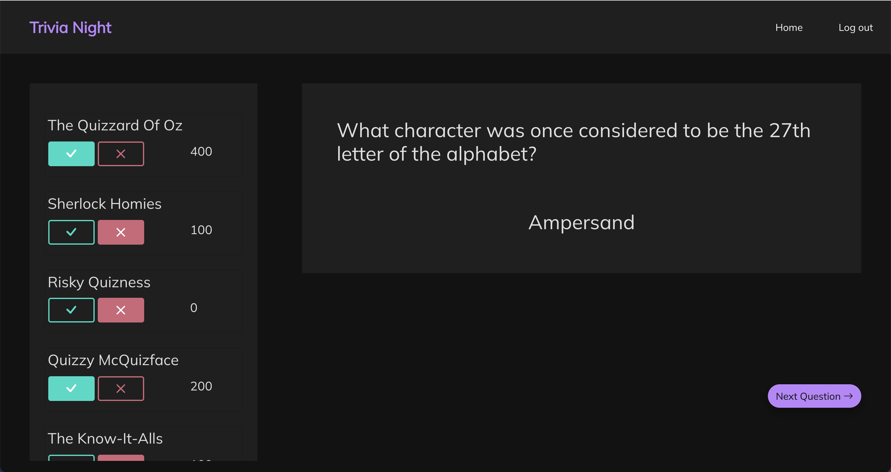

# Trivia Night

See the [deployed app](https://trivia-night-1.herokuapp.com/)

[Link](https://github.com/mckennapenley/trivia-night-rails) to React frontend

#

## About

Trivia Night is an app that allows restaurants and bars to host their own team trivia night. Select question difficulty, number of questions, and enter as many teams as you want. Trivia Night will keep track of team score and reveal team rankings at the end!

Builts with:

- Ruby on Rails
- React
- PostgreSQL
- RSpec
- HTML, CSS, BootStrap
- OpenTriviaDB API

#

## Screenshot

<p align="center">

</p>

#

## Getting Started

Running natively
1.) Make sure your ruby environment is at least 3.0.0

```
ruby --version
```

2.) Make sure your node version is at least 16.13.1

```
node --version
```

3.) bundle install <br>

in rails folder:

```
gem install bundle
bundle install
```

4.) npm install <br>

in react folder:

```
npm install
```

5.) Create and migrate databases <br>

in rails folder:

```
bundle exec rake db:create && bundle exec rake db:migrate
```

7.) Start the development server <br>

in rails folder:

```
rails s
```

in react folder:

```
run npm start
y
```

8.) Navigate to localhost:3001

#

## Future Enhancements

- Add capability to present questions with multiple choice answers
- Create Question has many Responses relationship so users can see and edit previous responses to previous questions
- Add timer countdown clock
- Add ability to show/hide answer
